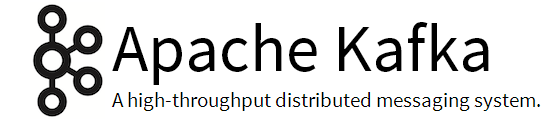

# Kafka 200

A [SFEIR School](https://www.sfeir.com/formation/school/)

[Planning, trainers and other details](https://www.sfeir.com/school/kafka-200/)

# Slides

You can view the slides [here](https://sfeir-open-source.github.io/sfeir-school-kafka/).

# Steps

Each exercise has two directories:

- a clean directory to get you started (ex: step-03)
- a solution directory (ex: step-03-solution)
